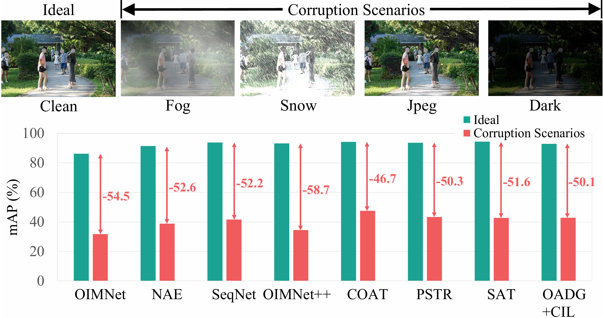

## Robust Person Search

Official PyTorch implementation of "Towards Robustness of Person Search against Corruptions" (ICCV 2025). [[Paper](https://openaccess.thecvf.com/content/ICCV2025/papers/Son_Towards_Robustness_of_Person_Search_against_Corruptions_ICCV_2025_paper.pdf)]

***Release in progress. Follow for updates!***

## 🗓️ Updates
- [10/2025] Initial update, Datasets released.

## 📖 Overview

> Person search aims to simultaneously detect and re-identify a query person within an entire scene. While existing studies have made significant progress in achieving supe rior performance on clean datasets, the challenge of ro bustness under various corruptions remains largely unex plored. However, the lack of proper testing environments for corrupted conditions persists as a challenge, since ex tensive collection of new person images attempting to cover numerous corruption scenarios inevitably introduces pri vacy concerns. In this context, we establish an evalua tion framework for analyzing corruption robustness using existing publicly available data, and introduce two new benchmarks: CUHK-SYSU-C and PRW-C. Based on this framework incorporating 18 corruptions with 5 severity lev els each, we conduct an extensive robustness evaluation of popular person search methods. Moreover, we explore a straightforward solution that naturally arises: integrat ing corruption-robust detection and re-identification mod els. Our experiments reveal that existing person search models remain highly vulnerable to corruption, and this is sue is not resolved by the simple integration approach. To analyze the underlying reasons, we further investigate the vulnerability of the detection and representation stages to corruption and explore its impact on both foreground and background areas. Based on these analyses, we propose a foreground-aware augmentation and corresponding robust proposal regularizer to enhance the robustness of person search models. Supported by our comprehensive robustness analysis and evaluation framework our benchmarks provide, our proposed technique substantially improves the robustness of existing person search models.

## 🔨 Installation

### Environment Setup
Create a conda environment and install dependencies:
```bash
conda create -n robust_ps python=3.8
conda activate robust_ps
pip install -r requirements.txt
```

## Dataset Installation

### 1. Prepare clean version datasets

Download the datasets, [CUHK-SYSU](https://github.com/ShuangLI59/person_search), [PRW-v16.04.20](https://github.com/liangzheng06/PRW-baseline). Set the root path of the dataset in configs/cuhk.yaml, "INPUT: DATA_ROOT:", or set it in scripts/create_cuhk_sysu_c.sh.

### 2. Generate corrupted benchmarks

Run the following scripts to create CUHK-SYSU-C and PRW-C benchmarks:
```bash
# Navigate to project directory
cd robust-person-search

# Generate CUHK-SYSU-C
bash scripts/create_cuhk_sysu_c.sh

# Generate PRW-C
bash scripts/create_prw_c.sh
```
